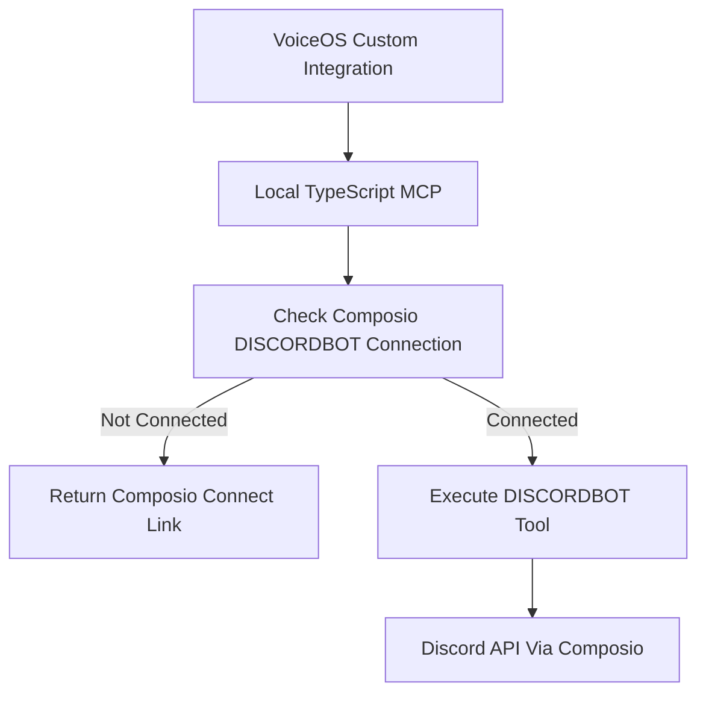

# Composio DISCORDBOT Architecture

This MCP server keeps VoiceOS's local stdio custom-integration model while delegating Discord authentication and execution to Composio.

## Runtime Flow



## Local Prototype

The local MCP process reads:

```bash
COMPOSIO_API_KEY=your_composio_api_key
VOICEOS_USER_ID=local-test-user
COMPOSIO_TOOLKIT=DISCORDBOT
```

`VOICEOS_USER_ID` is required by Composio because connected accounts are scoped to a user. For local testing, this can be any stable string.

## Production VoiceOS

Users should not provide `VOICEOS_USER_ID` manually.

Production VoiceOS should:

1. Use the logged-in VoiceOS user's internal UUID.
2. Create or run the MCP session using that UUID as the Composio `user_id`.
3. Keep the Composio API key in VoiceOS-managed secrets, not on the user's machine.
4. Show the Composio Connect Link when the user needs to authenticate Discord.

Do not use Discord email as the primary user ID. The Composio connect link requires a user ID before Discord OAuth completes, and Discord email can be unavailable or mutable.

## Auth Gating

Every Discord tool should first check whether `DISCORDBOT` is authenticated for the current Composio user.

If not authenticated, tools return:

```text
Discord is connected to VoiceOS, but your Discord bot/account connection is not authenticated in Composio yet.

Please connect Discord here: https://connect.composio.dev/link/...

After completing authentication, retry your request.
```

This applies to read, write, reply, and channel-list requests.

## Tool Mapping

| MCP Tool | Composio Tool |
| --- | --- |
| `list_discord_channels` | `DISCORDBOT_LIST_GUILD_CHANNELS` |
| `read_discord_messages` | `DISCORDBOT_LIST_MESSAGES` |
| `send_discord_message` | `DISCORDBOT_CREATE_MESSAGE` |
| `reply_discord_message` | `DISCORDBOT_CREATE_MESSAGE` with `message_reference` |

`list_discord_servers` is limited because the current `DISCORDBOT` docs expose channel listing by guild ID, but not a general bot guild-list tool. Use `DISCORD_GUILD_IDS` locally or provide a guild ID in the user request.

## DM Limitations

Composio `DISCORDBOT` supports bot-accessible channel messaging, message reads, replies, guild channel listing, and bot-created DMs.

It does not grant broad access to a user's existing personal DMs. Group DM operations require user OAuth2 access tokens with `gdm.join` and remain constrained by Discord API limitations.
