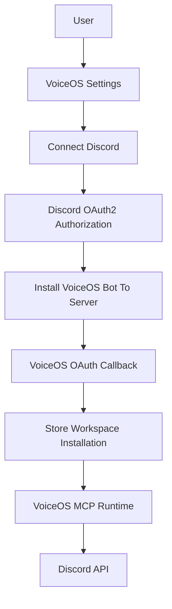

# Discord OAuth Architecture for VoiceOS

This document describes how VoiceOS could evolve from manual bot-token setup to a seamless **Connect Discord** flow.

## Current Implementation

The current MCP server uses a Discord bot token supplied through `DISCORD_BOT_TOKEN`.

This is simple and works well for local MCP usage:

1. User creates a Discord Application.
2. User creates a bot.
3. User invites the bot to their server.
4. User launches the MCP server with `DISCORD_BOT_TOKEN`.

The downside is setup friction. Users must leave VoiceOS, create credentials, copy tokens, and manually configure permissions.

## Recommended Future Flow

VoiceOS should own a first-party Discord application and bot. The user clicks **Connect Discord** in VoiceOS, completes Discord OAuth, and authorizes the VoiceOS bot into a server.



## OAuth Scopes

For bot installation:

- `bot`: Adds the VoiceOS bot to the selected Discord server.
- `applications.commands`: Optional, only needed if VoiceOS also exposes Discord slash commands.

For user identity during setup:

- `identify`: Lets VoiceOS identify the connecting Discord user.
- `guilds`: Lets VoiceOS list servers the user can choose from.

For acting as a user:

- Discord generally does not support broad user-account automation for normal message send/read workflows in the same way Slack does. The safer and more compliant architecture is bot installation, where the VoiceOS bot acts as itself inside authorized servers.

About `messages.read`:

- Discord has a `messages.read` OAuth2 scope, but it is for specific OAuth contexts and does not replace bot permissions for typical server/channel message access.
- For this MCP integration, server channel access should be granted through bot permissions: `View Channels`, `Read Message History`, and `Send Messages`.

## Permission Set

The OAuth install URL should request the smallest bot permission set required:

- `View Channels`
- `Read Message History`
- `Send Messages`

Discord bot permission integers can be generated in the Discord Developer Portal OAuth2 URL Generator. For the minimum permissions above, VoiceOS should generate and store the exact integer from the current Discord permission calculator rather than hard-code it in client code.

Optional future permissions:

- `Add Reactions`: If VoiceOS adds reaction support.
- `Manage Messages`: Only if VoiceOS adds moderation actions. This should not be included by default.
- `Attach Files`: If VoiceOS sends generated files or uploads.

## High-Level Flow

1. User opens VoiceOS settings and clicks **Connect Discord**.
2. VoiceOS opens a Discord OAuth2 URL with scopes `bot identify guilds`. Add `applications.commands` only if VoiceOS also installs slash commands.
3. User selects a server and authorizes the VoiceOS bot with required permissions.
4. Discord redirects to the VoiceOS backend callback with an authorization code.
5. VoiceOS exchanges the code for an access token.
6. VoiceOS stores:
   - Discord user ID
   - Installed guild/server ID
   - Bot installation metadata
   - Optional OAuth access/refresh token for setup UX
7. VoiceOS MCP runtime uses the VoiceOS-managed bot token server-side.
8. The VoiceOS client exposes available servers/channels to the user.
9. When the user asks to read or send a Discord message, VoiceOS calls the Discord MCP tool.
10. Before write actions, VoiceOS shows the confirmation pill with channel and message content.
11. After confirmation, the MCP tool sends the Discord API request.

## Token Storage

For a managed VoiceOS integration, end-user devices should not store the first-party Discord bot token.

Recommended storage:

- VoiceOS backend stores the application bot token in secrets management.
- VoiceOS stores per-user/per-workspace Discord installation records.
- MCP runtime receives a short-lived internal credential or calls through a VoiceOS backend proxy.

## Local MCP vs Managed OAuth

There are two viable runtime models:

### Local MCP With User Bot Token

Pros:

- Simple.
- No VoiceOS backend required.
- Good for developers and power users.

Cons:

- Manual setup.
- Users handle bot tokens.
- Harder to provide a polished app-store-style connection.

### Managed VoiceOS Discord App

Pros:

- One-click Discord setup.
- No copied bot tokens.
- Centralized permission and installation management.
- Better UX for non-technical users.

Cons:

- Requires VoiceOS backend OAuth callback.
- Requires secure token storage.
- Requires installation database and disconnect/revoke handling.

## Disconnect Flow

VoiceOS should support disconnecting Discord:

1. User clicks **Disconnect Discord** in VoiceOS.
2. VoiceOS deletes the installation record.
3. VoiceOS optionally directs the user to remove the bot from the Discord server.
4. Future MCP calls for that guild fail with a clear reconnection message.

## Confirmation Pill Data

For write actions, the VoiceOS UI should present:

- Action: Send Discord message or Reply to Discord message.
- Target channel ID or resolved channel name.
- Reply target message ID, if applicable.
- Exact message content.
- Mention parsing state.

The MCP tool schemas already provide explicit parameter descriptions for this.

## MCP Config Generation

For local MCP, VoiceOS can launch:

```bash
DISCORD_BOT_TOKEN=... npx tsx /path/to/index.ts
```

For managed OAuth, VoiceOS should generate MCP configuration from the stored guild installation rather than exposing raw Discord bot credentials to the user device.
