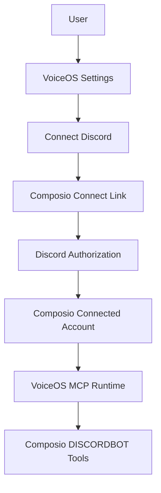

# Discord OAuth Architecture for VoiceOS

This document records the original direct-Discord OAuth thinking and the current Composio-backed direction.

## Current Direction

The MCP now uses Composio's `DISCORDBOT` toolkit instead of requiring users to paste a Discord bot token into VoiceOS.

Local testing uses:

```bash
COMPOSIO_API_KEY=...
VOICEOS_USER_ID=local-test-user
COMPOSIO_TOOLKIT=DISCORDBOT
```

Production VoiceOS should not ask users for `VOICEOS_USER_ID`. VoiceOS should inject its own logged-in internal user ID automatically and keep the Composio API key in VoiceOS-managed secrets.

## Recommended Production Flow

VoiceOS should use Composio as the OAuth/connected-account layer. The user clicks **Connect Discord** or asks a Discord request, receives a Composio Connect Link, completes auth in the browser, and then retries the action.



## Auth Gating

Every Discord MCP tool should first check whether the current Composio user has an active `DISCORDBOT` connected account.

If not, return a Composio Connect Link and do not execute the Discord action.

If yes, execute the matching `DISCORDBOT` tool.

## User Identity

Composio connected accounts require a stable `user_id`.

For local testing:

```bash
VOICEOS_USER_ID=local-test-user
```

For production:

- VoiceOS should use its internal logged-in user UUID.
- Users should not manually type this value.
- Discord email should not be the primary user ID because it may be unavailable or change.

## Discord Scope And DM Caveats

Composio `DISCORDBOT` supports bot-accessible channel messaging, message reads, replies, guild channel listing, and bot-created DMs.

It does not grant broad access to a user's existing personal DMs. Group DM operations require user OAuth2 access tokens with `gdm.join` and remain constrained by Discord API limitations.

## Disconnect Flow

VoiceOS should support disconnecting Discord:

1. User clicks **Disconnect Discord** in VoiceOS.
2. VoiceOS deletes or disables the Composio connected account.
3. Future MCP calls return a reconnection link.

## Confirmation Pill Data

For write actions, the VoiceOS UI should present:

- Action: Send Discord message or Reply to Discord message.
- Target channel ID or resolved channel name.
- Reply target message ID, if applicable.
- Exact message content.
- Mention parsing state.

The MCP tool schemas already provide explicit parameter descriptions for this.

## MCP Config Generation

For local MCP, VoiceOS can launch:

```bash
/path/to/run-discord-mcp.sh
```

For production, VoiceOS should generate the MCP runtime context from its logged-in user session rather than exposing raw Composio or Discord credentials to the user device.
